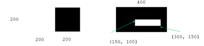

# CVLabs
# CVLabs Lab 1

1. Создать в качестве изображения черный квадрат размером 400*400 пикселей. 
2. Нарисовать в нем отрезок зеленого цвета между точками с координатами (15, 20) и (70, 50).
3. Нарисовать в нем окружность синего цвета с центром в точке с координатами (200, 200) и радиусом 32
4. Нарисовать в нем эллипс красного цвета со следующими параметрами
- центр в точке с координатами (200, 200) , 
- оси 100 и 160
- угол поворота эллипса в градусах 45
- начальный и конечный углы эллиптической дуги в градусах 0 и 360
5. Нарисовать в нем прямоугольник желтого цвета с координатами противоположных вершин (15, 20) и (70, 50)
6. Нарисовать в нем полигоны следующих видов

[210, 390] – координаты точки, указанной стрелкой
При реализации используйте следующие функции:
`fillPoly(img, pts, color) -> img`

Параметры

    img	Image.
    pts	Array of polygons where each polygon is represented as an array of points.
    color	Polygon color.

---
`polylines(img, pts, isClosed, color) -> img`

Параметры

    img	Image.
    pts	Array of polygonal curves.
    isClosed	Флажок, указывающий, замкнуты ли нарисованные полилинии или нет. Если они замкнуты, функция проводит линию от последней верши-ны кривой к ее первой вершине.
    color	Polyline color.
---
7. Нарисовать в нем текстовую строку “Hello, world!” 
- шрифтом ITALIC пурпурного цвета (координаты нижнего левого угла (20, 375))
- шрифтом HERSHEY_SCRIPT_COMPLEX голубого цвета (координаты нижнего левого угла (80, 50))

При реализации используйте функцию

`putText(img, text, org, fontFace, fontScale, color[, thick-ness]) -> img` 

Параметры
    img		Image.

    text		Text string to be drawn.
    org		Нижний левый угол текстовой строки на изображении.
    fontFace	Font type, see HersheyFonts.
    fontScale	Font scale factor that is multiplied by the font-specific base size.
    color	        Text color.
    thickness	Thickness of the lines used to draw a text`

# CVLabs Lab 2

## 1. Градационные преобразования

- выполнить логарифмическое преобразование изображения `moscow.jpg`.
- выполнить гамма-коррекцию изображения moscow.jpg для следующих значений гамма: `0.1, 0.5, 1.2, 2.2`
- выполнить над изображением `moscow.jpg` кусочно-линейное преобразование вида

- 
 
с параметрами `r1 = 70, s1 = 0, r2 = 140, s2 = 255`

## 2. Логические операции
   - создать 2 изображения `img1 `и `img2` размером 200х400 вида

&nbsp;&nbsp;&nbsp;&nbsp;&nbsp;&nbsp;&nbsp;&nbsp;&nbsp;&nbsp;&nbsp;&nbsp;&nbsp;&nbsp;&nbsp;&nbsp;&nbsp;&nbsp;&nbsp;&nbsp;&nbsp;&nbsp;&nbsp;&nbsp;&nbsp;&nbsp;&nbsp;img1 &nbsp;&nbsp;&nbsp;&nbsp;&nbsp;&nbsp;&nbsp;&nbsp;&nbsp;&nbsp;&nbsp;&nbsp;&nbsp;&nbsp;&nbsp;&nbsp;&nbsp;&nbsp;&nbsp;&nbsp;&nbsp;&nbsp;&nbsp;&nbsp;&nbsp;&nbsp;&nbsp;&nbsp;&nbsp;&nbsp;&nbsp;&nbsp;&nbsp;&nbsp;&nbsp; img2

- И записать их в файлы `drawing1.jpg` и `drawing2.jpg` соответственно

- выполнить логические операции: инверсия, конъюнкция, дизъюнкция, исключающее ИЛИ над изображениями img1 и img2.

**Напоминание:** Результат выполнения операции XOR над двумя битами равен 1, когда один из битов равен 1

- выполнить отображения исходного и результирующего изображений для всех логических операций

