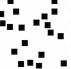
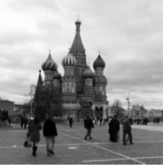

# CVLabs
# CVLab 7

При реализации фильтрации в частотной области используются следующие функции:

`np.fft.fft2()` – выполняет двумерное дискретное преобразование Фурье
Используется для вычисления двумерного дискретного преобразования Фурье (DFT) двумерного массива. Он принимает входной массив комплексных чисел и возвращает выходной массив той же формы, содержащий коэффициенты DFT.
В результате получается массив комплексных чисел, где каждый элемент пред-ставляет амплитуду и фазу определенной частотной составляющей во входных данных.

`np.fft.fftshift()` – сдвигает компонент нулевой частоты в центр спектра.
По сути реализует операцию центрирования спектра

`np.fft.ifft2()` – выполняет обратное двумерное дискретное преобразование Фурье
Возвращает массив комплексных чисел

`np.fft.ifftshift()` – выполняет действие, обратное np.fft.fftshift(). Перемещает низ-кую частоту из центра в верхний левый угол.

`np.linspace()` - создает последовательность данных, равномерно расположенных на числовой прямой в заданном интервале.

`np.newaxis()` – позволяет увеличить размерность массива (с 2-х до 3-х, 3-х до 4-х и т.д.)

1. Выполните процедуру фильтрации в частотной области, используя
ФНЧ Баттерворта. Параметры фильтра:` n=2,` используйте значения `D0 =0.05, 0.5, 10.0`
В качестве входного изображения взять файл` white_sq.jpg`

Выполните отображение исходного и результирующего изображений, а также амплитудный спектр фильтра

2. На примере использования файла `moscow.jpg` 

покажите, что последовательное применение прямого и обратного преобразований Фурье приводят к исходному изображению.
