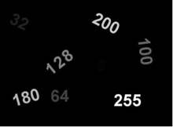

# CVLabs
# CV Lab 9

1. Глобальная бинаризация изображения

Разработайте программу, обеспечивающую глобальную бинаризацию изображения `threshold.jpg`. Число на изображении соответствует значению яркости, которым оно изображено.

Выбрать `maxval = 255`

Выполнить для 2-х типов порога:
`-THRESH_BINARY  (значения thresh = 32 и 128)
-THRESH_OTSU`

Выполнить отображение исходного и результирующего изображений

Для реализации используйте функцию
`threshold(src, thresh, maxval, type[, dst]) -> retval, dst` 

Применяет порог фиксированного уровня к каждому элементу входного мас-сива

Параметры:

    src - входной массив.
    dst - выходной массив того же размера и типа, что и src.
    thresh - пороговое значение.
    maxval - максимальное значение для использования с пороговыми значениями THRESH_BINARY и THRESH_BINARY_INV.
    type - тип порога. Возможные значения THRESH_BINARY, THRESH_BINARY_INV, THRESH_TRUNC, THRESH_TOZERO, THRESH_TOZERO_INV. Специальные значения THRESH_OTSU или THRESH_TRIANGLE могут быть объединены с одним из вышеуказанных значе-ний (cv.THRESH_BINARY + cv.THRESH_OTSU). В этих случаях функция опре-деляет оптимальное пороговое значение (параметр thresh игнорируется), исполь-зуя алгоритм Otsu или Triangle, и использует его вместо указанного порога.
Возвращаемое значение:
    порог `retval` - Если это глобальный алгоритм с фиксированным порогом (например, THRESH_BINARY), будет возвращено значение параметра threshold.
    Если это алгоритм глобального адаптивного порога (например, THRESH_OTSU), он возвращает соответствующий порог, рассчитанный с по-мощью адаптивного.

2. Адаптивная пороговая бинаризация изображения

Разработайте программу, обеспечивающую адаптивную пороговую бинаризацию изображения adapt_threshold.jpg
Проверить на различных размерах `blockSize`. Выбрать подходящий.
Сравнить с глобальной пороговой бинаризацией `Otsu`.
Выполнить отображение исходного и результирующего изображений

Для реализации используйте функцию

`adaptiveThreshold(src, maxValue, adaptiveMethod, thresholdType, blockSize, C[, dst]) -> dst`

Параметры:

    src - входной массив.
    dst - выходной массив того же размера и типа, что и src.
    maxval - максимальное значение для использования с пороговыми значениями THRESH_BINARY и THRESH_BINARY_INV.
    adaptiveMethod - адаптивный метод. Возможные значения ADAPTIVE_THRESH_MEAN_C, ADAPTIVE_THRESH_GAUSSIAN_C - среднее  и взвешенное среднее значение окрестности blockSize × blockSize точки - C,
    thresholdType - тип порога. Возможные значения THRESH_BINARY, THRESH_BINARY_INV
    blockSize - размер окрестности пикселя, который используется для вычисления порогового значения.
    C - константа, вычитаемая из среднего или взвешенного среднего

3. Разработать программу для реализации метода выращивания областей на изображении `region_growing.jpg`.

Выращиваемые области:

    пятиугольник
    прямоугольник
    4-х угольная звезда выделить белым цветом. 

Использовать 8-связную смежность
Пояснение:

В качестве центров кристаллизации выбраны точки `[(176,255), (229,405), (347,165)]` соответственно из пятиугольника, 4-х угольной звезды и прямоугольника
